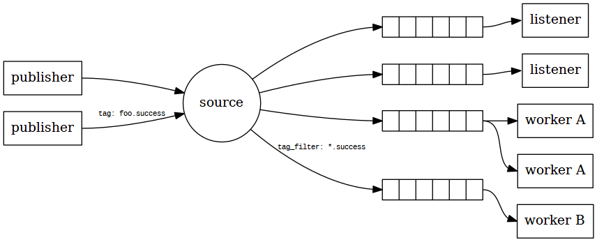
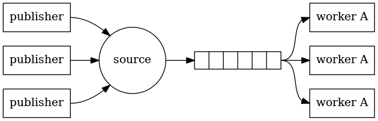

mercury
=======

Mercury is a messaging layer that hides complexity for typical messaging scenarios.

- backed by [AMQP][amqp]
- runs in an [EventMachine][em] reactor
- asynchronous API
- serializes messages as JSON
- optional monadic interface makes testing easier
- simulator allows tests to run without a RabbitMQ server

### Constructs



In the above example, two publishers independently publish messages to the same source.
One of them chooses to attach the tag `foo.success` to the messages it publishes.
When the source receives a message, it immediately broadcasts the message to all attached
queues.

Two independent listeners receive messages from the source. A listener has a private
queue that is automatically removed when the listener disconnects from the server (i.e.,
any queued messages the listener would have received are lost).

A worker pool "A" has two workers handling messages. Messages in the queue are dealt
to the workers as the workers acknowledge handling prior messages. If a worker disconnects
without acknowledging completion, the message(s) it was working on are automatically replaced at the
head of the queue. Worker queues persist even if all workers disconnect. Each worker pool
has its own queue. Consequently, workers within a pool compete for messages, whereas workers
across pools do not compete for messages.

Worker pool "B" has just one worker and has specified a tag filter.

Listeners and worker pools can specify _tag filters_ which limit the messages they receive
to only those with tags matching a particular pattern. A _tag_ is zero or more words delimited
by periods. A _word_ is a string of alphanumeric characters. A _filter_ is a string of zero or more
words or wildcards. A _wildcard_ is either `*` or `#`.

- `*` matches exactly one word.
- `#` matches zero or more words.

_Note:_ A filter with zero words (`''`) matches no messages.

_Note:_ Wildcards match only entire words. The filter `f*.success` does not match the tag `foo.success`.

A typical scenario is to have a single worker pool processing messages.



The publishers are often instances of the same service: either some
other mercury worker pool or a web service.


### Operations

**open**(_parallelism_)

Creates a mercury instance. _paralellism_ is a natural number that indicates
the maximum total number of outstanding (unacknowledged) messages allowed
for this instance's workers. See the code for additional parameters.

**publish**(_source_name_, _msg_, _tag_)

Publishes a message to a source, with an optional tag.

**start_worker**(_worker_pool_name_, _source_name_, _tag_filter_, _msg_handler_)

Starts a worker in the specified pool subscribing to the specified
source with the specified filter (optional). Incoming messages are
passed to the message handler procedure.

**start_listener**(_source_name_, _tag_filter_, _msg_handler_)

Starts a listener.

**ack**(_msg_)

Indicates message handling succeeded. The message is removed from the queue.

**nack**(_msg_)

Indicates message handling failed, with the assumption that it might succeed at
a later time. The message is returned to the front of the queue.

**reject**(_msg_)

Indicates message handling failed, with the assumption that it can never succeed.
The message is removed from the queue.

**republish**(_msg_)

Like **nack**, except the message is returned to the _back_ of the queue.

_Note:_ All operations create the referenced constructs if they do not already exist.

### Serialization

If a message is a hash, mercury serializes it to JSON upon sending and deserializes
it upon receiving.

If a message is a string, mercury writes it directly without any
serialization; this allows a client to pre-encode a message using an
arbitrary encoding. The receiving client receives the exact same
string as the message content (assuming the serialized message fails to
parse as JSON).

### Logatron integration

Mercury depends on the
[`logatron`][logatron] gem and propagates
logatron's request ID (`Logatron.msg_id`) through the AMQP header
`X-Ascent-Log-Id`. This enables a log aggregation service to find the
logs associated with a particular incoming request, even though the
log entries may be scattered across various services.

Mercury also sets the current site from the message as the Logatron site
('Logatron.site'). This value is set in differently in the different messages in our
system, which are currently hard-coded into Mercury.

### Thread safety

Mercury is not threadsafe. All calls to a particular instance must be made from the
thread in which the instance was created.

### Error handling

If there is a communication error (e.g., the connection to the server breaks)
mercury raises an error. This behavior can be overridden.

### Long running operations

The AMQP gem uses EventMachine timers to send heartbeats to the
server. Message handling blocks the event loop, so each message must
be handled within a few seconds, otherwise the server will miss a
heartbeat and disconnect the client. Long-running message handlers
should move their work to a thread pool to avoid blocking the event
loop.
[`EventMachine.defer`][em_defer]
and
[`fiber_defer`][fiber_defer]
are two facilities for accomplishing this.


### Example Usage


```ruby
require 'mercury'

def run
  EventMachine.run do
    Mercury.open do |m|
      m.start_worker('cooks', 'orders', method(:handle_message)) do
        # When this continuation block is called, the worker is guaranteed
        # to have been started, so we can start publishing orders.
        m.publish('orders', {'table' => 5, 'items' => ['salad', 'steak', 'cake']})
      end
    end
  end
end

def handle_message(msg)
  order = msg.content
  cook(order)
  msg.ack
end
```

Notably, mercury also has a monadic interface that hides the explicit
continuation passing introduced by asynchrony, which has the effect of
flattening chained calls. This is particularly useful for testing,
where the same code plays both sides of a conversation. Compare:

```ruby
require 'mercury'

Mercury.open do |m|
  m.start_listener(source, proc{}) do
    m.source_exists?(source) do |r1|
      expect(r1).to be true
      m.delete_source(source) do
        m.source_exists?(source) do |r2|
          expect(r2).to be false
          m.close do
            done
          end
        end
      end
    end
  end
end

# ... vs ...

require 'mercury/monadic'

seql do
  let(:m)  { Mercury::Monadic.open    }
  and_then { m.start_listener(source) }
  let(:r1) { m.source_exists?(source) }
  and_lift { expect(r1).to be true    }
  and_then { m.delete_source(source)  }
  let(:r2) { m.source_exists?(source) }
  and_lift { expect(r2).to be false   }
  and_then { m.close                  }
  and_lift { done                     }
end
```

Monadic Interface
-----------------

The _monad_ is a versatile design pattern. There is plenty of
literature online, but for now all you need to know is that mercury
uses monad principles to chain together asynchronous operations. It
all starts with a `Cps` object.

```
2.2.2 :005 > add1 = Cps.new { |n, &k| k.call(n+1) }
 => #<Mercury::Cps:...>
```

Much like `Proc.new`, `Cps.new` merely captures some operation in an
object but does not do any actual work. The key difference is that
`Cps` captures a "continuation-passing style" ("CPS") operation. That is,
instead of returning a value to the caller, the operation takes its
continuation as an additional argument `k`. (The actual name doesn't matter,
of course, but `k` is traditional.) `k` is simply a `Proc`.
You can loosely think of it as the "return _`Proc`_", as opposed to
the usual return _statement_.

To invoke a `Proc` we call `Proc#call`. To invoke a `Cps`, we call
`Cps#run`, passing the normal arguments as well as the continuation
(the block).

```
2.2.2 :006 > add1.run(2) { |result| puts "result = #{result}" }
result = 3
```

As you've seen already, asynchronous APIs are closely tied to CPS. In
the case of mercury, an operation may involve a conversation with the
server. CPS allows our code to go off and do other things -- namely,
handle other independent requests -- but also be notified when the
operation finally completes.

### Combining operations

`Cps` provides a means of combining operations into a larger
operation: `Cps#and_then`.

```ruby
def add1(n)
  Cps.new { |&k| k.call(n+1) }
end

def print_value(n)
  Cps.new do |&k|
    puts "value = #{n}"
    k.call
  end
end

def add1_and_print(n)
  add1(n).and_then { |v| print_value(v) }
end
```
```
2.2.2 :028 > add1_and_print(2).run
value = 3
```

`Cps#and_then`'s block accepts the result of the previous operation and
returns the `Cps` object representing the next operation to perform.

As it turns out, the best way to factor an operation is as a
method that

- accepts the operation arguments, and
- returns a `Cps` object

as seen above.

### Sequences

As you can imagine, long `and_then` chains can get syntactially messy.
This is where `seq` comes in.

```
def add1_and_print(n)
  seq do |th|
    th.en {     add1(n)        }
    th.en { |v| print_value(v) }
  end
end
```

This is still not ideal; it would be nice to have a way to bind `v` to
the result of `add1(n)` rather than introducing a parameter on the
line below. `seql` contains some magic that allows us to do
exactly this. (It also eliminates the weird `th.en`.)

```ruby
def add1_and_print(n)
  seql do
    let(:v)  { add1(n)        }
    and_then { print_value(v) }
  end
end
```

Another benefit of `seql` and `let` is that it makes `v` visible to
_all_ subsequent `and_then` blocks, not just the immediately following
one.

But what if we want to introduce a non-CPS operation into our
sequence?

```ruby
def add1_and_print(n)
  seql do
    let(:v)  { add1(n)        }
    and_then { puts 'added!'  }
    and_then { print_value(v) }
  end
end
```
```
2.2.2 :061 > add1_and_print(2).run
added!
RuntimeError: 'and_then' block did not return a Cps object.
```

This fails because it violates the requirement that the `and_then`
block return a `Cps` object, and `puts` does not. `lift` returns a
`Cps` object for a block of direct-style code.

```ruby
def add1_and_print(n)
  seql do
    let(:v)  { add1(n)                }
    and_then { lift { puts 'added!' } }
    and_then { print_value(v)         }
  end
end
```
```
2.2.2 :053 > add1_and_print(2).run
added!
value = 3
```

Finally, a little clean up:

```ruby
def add1_and_print(n)
  seql do
    let(:v)  { add1(n)        }
    and_lift { puts 'added!'  }
    and_then { print_value(v) }
  end
end
```

### `Mercury::Monadic`

`Mercury::Monadic` simply wraps `Mercury` so that the methods return
`Cps` objects rather than accepting an explicit continuation.

```ruby
seql do
  let(:m)  { Mercury::Monadic.open    }
  and_then { m.start_listener(source) }
  ...
end
```

It is particularly useful when writing tests.


Design Details
--------------

#### `Mercury#republish`

This method publishes a copy of the message to the _back_ of the
queue, then acks the original message. This is a similar operation to
ack/nack/reject. It is only applicable to messages received by
workers, since listener messages cannot be acknowledged. Unlike other
acknowledgements, `#republish` takes a continuation (due to the
publish operation), so the method is located on `Mercury` rather than
`Mercury::ReceivedMessage`.

It is important that the message is republished to the AMQP _queue_
and not the _source_. Acknowledgement is a worker concern. If two
different worker pools were working off a common source, it wouldn't
make sense for pool A to get a duplicate message because pool B failed
to handle the message.

AMQP allows publishing to a particular queue by sending the message to
the [default exchange][default_exchange], specifying the queue name as
the routing key. Thus, if the message was originally sent with a
non-empty routing key, that information is lost. Some clients rely on
the routing key/tag to dictate behavior (by reading
`Mercury::ReceivedMessage#tag`). To avoid breaking such clients,
republish propagates the original tag in a header and reports this value
as the tag on the republished message.

Republishing also introduces a `Republish-Count` header and
corresponding attribute `Mercury::ReceivedMessage#republish_count`.
This value is incremented each time the message is republished.
Clients may want to check this value and act differently if it exceeds
some threshold.


Design Decisions
----------------

#### Continuation blocks are required

It would be possible to make continuation blocks optional. The problem is that this allows the user
to make the mistake of treating the API as synchronous and only discover their error when tests fail,
probably intermittently. An empty block can be passed, but at least it indicates that the continuation
is being intentionally ignored.


[amqp]: https://github.com/ruby-amqp/amqp
[em]: https://github.com/eventmachine/eventmachine
[logatron]: https://github.com/indigobio/logatron
[em_defer]: http://www.rubydoc.info/github/eventmachine/eventmachine/EventMachine.defer
[fiber_defer]: https://github.com/indigobio/abstractivator/blob/master/lib/abstractivator/fiber_defer.rb
[default_exchange]: https://www.rabbitmq.com/tutorials/amqp-concepts.html
